# Home Gym

A workout log that you can access over wifi from your home gym. It includes an HTTP server with an embedded web app and an embedded database.

Home Gym requires authentication for access and supports multiple users. Users are authorized to access only their own data.

## General Status

The app is in MVP state. It's been tested in Chrome on a MacBook Pro and on an Android device. Test cases included only weightlifting exercises.

## Build and Install

1. Run the build.sh script.
2. Copy the binary from the `bin` folder to the computer that will run it.
3. On the host computer, create an environment variable named `HOMEGYM_DB_PATH` with the path to the directory where you want the database files to be stored.
4. Double-click the biinary to run it. To stop it, press Ctrl+C.

## How To Use

1. In a web browser, go to `http://<ip or hostname>/homegym/signup/` and create an account.
2. Go to `http://<ip or hostname>/homegym/login/` to log in.
3. On the Exercises page, define some exercises.
4. On the Activities page, define some activities and add exercises to them.
5. On the Home page, add workout entries for the activities.

 

### Track Failed Reps

Exercises that use sets and reps to express volume can optionally track failed attempts. Failed attempts is a useful metric for skill-based exercises such as the snatch and the clean and jerk.

## General Architecture

```mermaid
  flowchart LR
    user((User))

    db[(Database)]
    dal[DAL]
    auth[Authorizer]
    wl[WorkoutLog]
    api[" 🔒" REST API]
    gw[ API Gateway]
    wa[Web app]

    user --> wa --> gw
    gw -->|ID| auth --> dal --> db
    api --> wa
    auth -->|token|gw
    gw -->|token|api --> wl --> dal
```

## Back End

An HTTP server implemented in [Go](https://go.dev/) using [BadgerDB](https://dgraph.io/docs/badger/) for storage.

### Exercise Types

`ExerciseType` defines exercises in terms intensity and volume. It is a factory for `ExerciseInstance` objects that hold information about the performance of an exercise. `ExerciseType` also validates the data.

A limited number of intensity types and volume types are used to define how to express the performance of an exercise. For example, squats use weight as intensity and sets and reps to inidecate volume. Tempo runs can use heart rate zones as intensity and time as volume.

Exercise performance data is stored in the same format for all exercises. The `VolumeConstraint` property indicates how volume data should be interpreted.

### Signup and Login

### Badger DB Schema

/_ cSpell:disable _/

| Key                                                       | Value passed to/from dal | Description             |
| --------------------------------------------------------- | ------------------------ | ----------------------- |
| user:{id}#id                                              | string                   | username used to log in |
| user:{id}#email                                           | string                   | email address           |
| user:{id}#phash                                           | string                   | password hash           |
| user:{id}#version                                         | int                      | version of user record  |
| user:{id}#event:{date}#id:{id}#activity:{id}              | []byte                   | activity name           |
| user:{id}#event:{id}#exercise:{id}#index:{index}#instance | []byte                   | exercise instance       |
| user:{id}#activity:{id}#name                              | string                   | activity name           |
| user:{id}#activity:{id}#exercise:{id}                     | string                   | exercise type id        |
| user:{id}#exercise:{id}#type                              | []byte                   | exercise type value     |
| tokenkey:{keyID}                                          | []byte                   | token key               |
| pepperkey:{keyID}                                         | []byte                   | pepper key              |
| session:{sessionid}#userID:{userID}#expires               | int64                    | session expiration time |

/_ cSpell:enable _/

Event Keys:

- primary sort by date
- enable query by date range
- enable query by activity
- enable query by exercise type

## Front End

A single-page app implemented in [Vue.js](https://vuejs.org/) using [Quasar](https://quasar.dev/) components. You can probably tell that this is my first SPA.
