# Home Gym

A workout log that you can access over wifi from your home gym. It includes an HTTP server with an embedded web app and an embedded database:

- backend is implemented in [Go](https://go.dev/)
- database is [BadgerDB](https://dgraph.io/docs/badger/)
- front end is implemented in [VueJS](https://vuejs.org/) using [Quasar](https://quasar.dev/) components

Home Gym requires authentication for access and supports multiple users. Users are authorized to access only their own data.

## General Status

It's been tested in Chrome on a MacBook Pro and on an Android device.

## Build and Install

1. Run the build.sh script.
2. Copy the binary from the `bin` folder to the computer that will run it.
3. On the host computer, create an environment variable named `HOMEGYM_DB_PATH` with the path to the directory where you want the database files to be stored.
4. Double-click the binary to run it. To stop it, press Ctrl+C.

[User guide](./docs/how-to-use.md)

## General Architecture

```mermaid
  flowchart LR
    user((User))

    db[(Database)]
    dal[DAL]
    auth[Authorizer]
    wl[WorkoutLog]
    api[" 🔒" REST API]
    gw[ API Gateway]
    wa[Web app]

    user --> wa --> gw
    gw -->|ID| auth --> dal --> db
    api --> wa
    auth -->|token|gw
    gw -->|token|api --> wl --> dal
```

