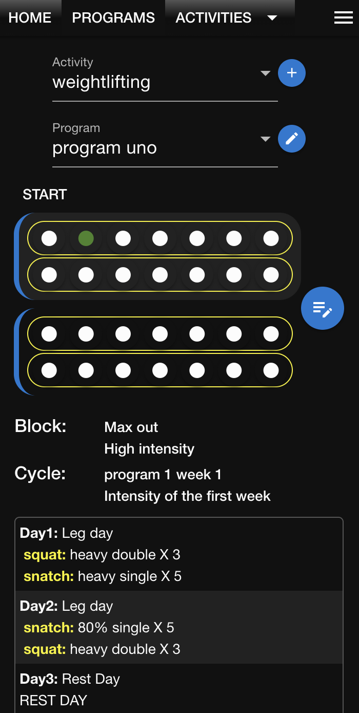
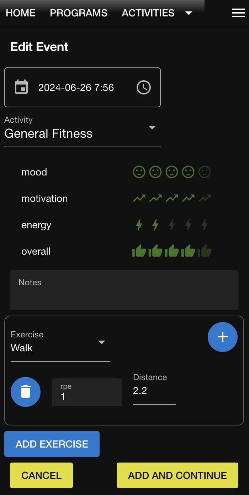
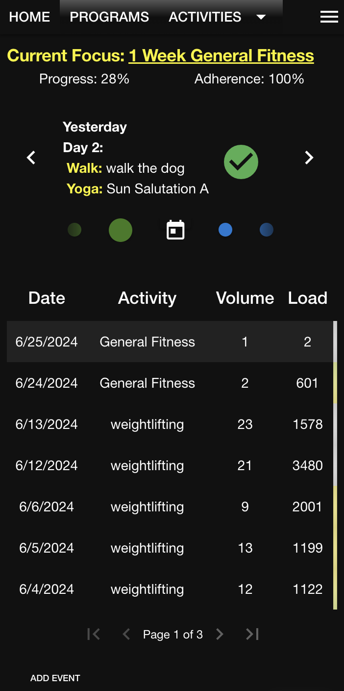

# How To Use

1. In a web browser, go to `http://<ip or hostname>/homegym/signup/` and create an account.
2. Go to `http://<ip or hostname>/homegym/login/` to log in.
3. On the Exercises page, define some exercises.

   

4. On the Activities page, define some activities and add exercises to them.

   

5. (Optional) On the Programs page, add a program that defines your workouts on a schedule. Programs consist of one or more blocks of microcycles. The number of days in a microcycle is configurable.

   

6. Start the program and set the start date, or just do random workouts.

7. On the Home page, add workout entries:

   

   - If you're running a program, click the button on the program dashboard to open the event editor.
   - If you're freewheeling it, click the Add Event button at the bottom of the page.

8. Add the details.

   

If you're running a program, the scheduled workout is associated with the event in the log.

   

### Track Failed Reps

Exercises that use sets and reps to express volume can optionally track failed attempts. Failed attempts is a useful metric for skill-based exercises such as the snatch and the clean and jerk.
