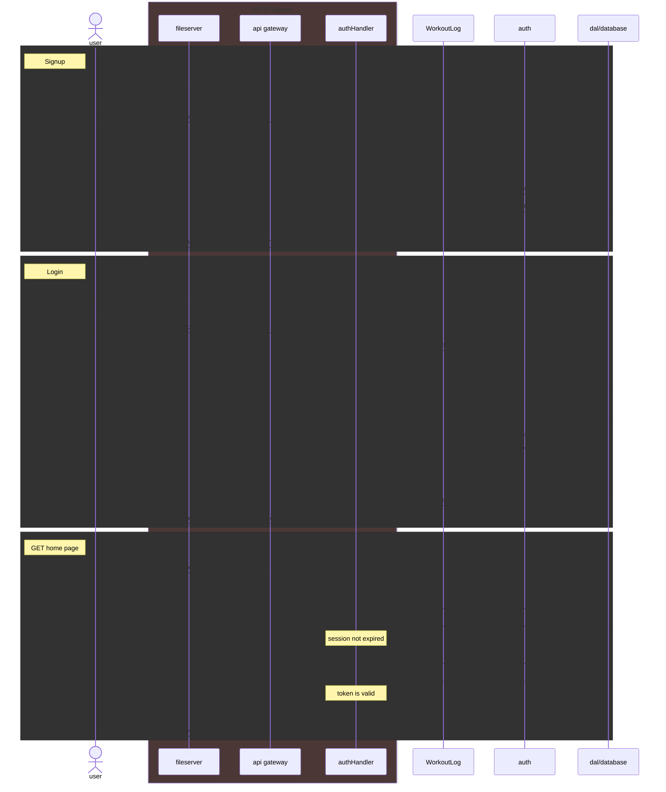

### Signup and Login

/_ cSpell:disable _/

```mermaid
sequenceDiagram
Actor user

box rgb(75,56,54) HTTP Server
Participant fs as fileserver
Participant gw as api gateway
Participant ah as authHandler
end

Participant wl as WorkoutLog
Participant a as auth
Participant db as dal/database

rect rgb(50, 50, 50)
Note left of user: Signup
user->>fs: GET /homegym/signup/
fs->>user: signup.html
user->>ah: form POST /homegym/signup
ah->>wl: call NewUser()
wl->>a: hash password
a->>wl: return
wl->>db: add user records
db->>wl: return
wl->>ah: return
ah->>user: 302 StatusFound redirect to /homegym/login/
end
rect rgb(50,50,50)
Note left of user: Login
user->>fs: GET /homegym/login/
fs->>user: login.html
user->>ah: form POST /homegym/login
ah->>a: call IssueToken
a->>db: read user records
db->>a: return password hash
a->>db: create session
db->>a: return
a->>a: schedule session deletion
a->>db: read private key
db->>a: return
a->>ah: return sessionID, JWT
ah->>user: 302 /homegym/home/ + sessionID, userID, and token cookies
end
rect rgb(50,50,50)
Note left of user: GET home page
user->>gw: GET /homegym/home/ + cookies
gw->>ah: call ValidateToken
ah->>db: read session
db->>ah: return session
Note over ah: session not expired
ah->>db: read private key
db->>ah: return
Note over ah: token is valid
ah->>gw: return refreshed token
gw->>user: index.html + token cookie
end
```

/_ cSpell:enable _/
