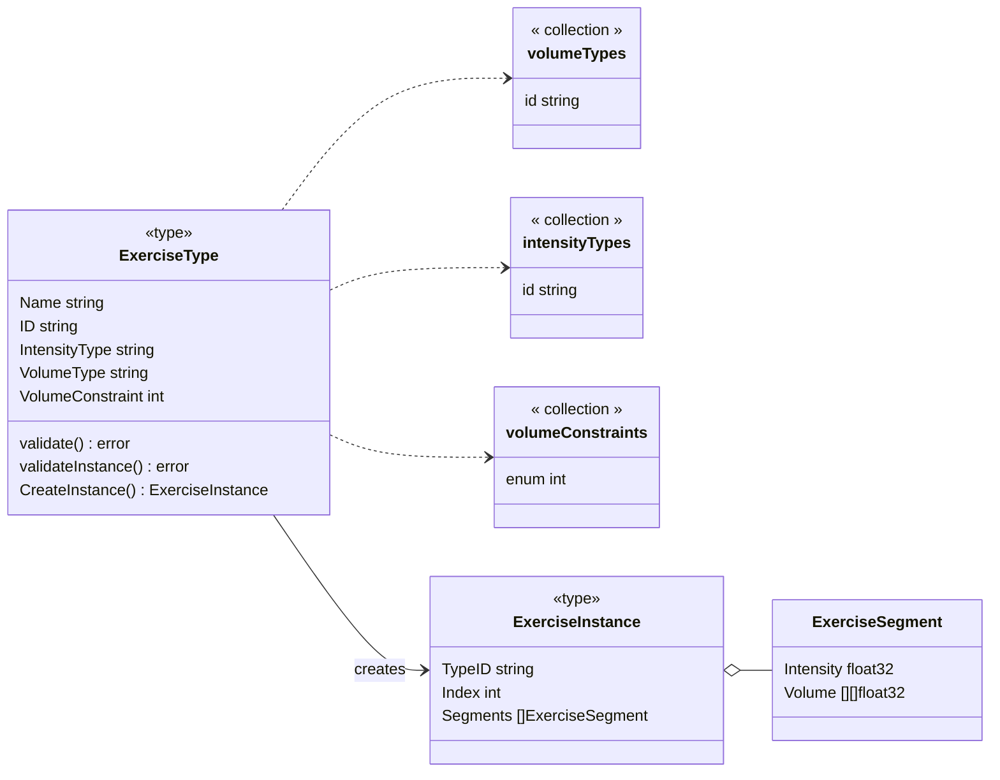

### Exercise Types

`ExerciseType` defines exercises in terms of intensity and volume. It is a factory for `ExerciseInstance` structs that hold information about the performance of an exercise. `ExerciseType` also validates the data.

A limited number of intensity types and volume types are used to define how to express the performance of an exercise. For example, squats use weight as intensity and sets and reps to indicate volume. Tempo runs can use heart rate zones as intensity and time as volume.

Exercise performance data is stored in the same format for all exercises. The `VolumeConstraint` property indicates how volume data should be interpreted by the client.

